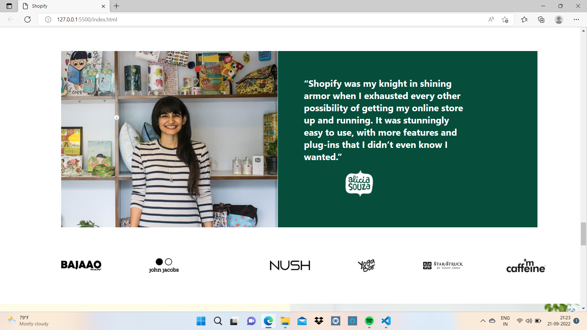

# Project Title : SHOPIFY

## About 

This was my second tailwind project to build Shopify clone.

## What Did I Learn From This project

I learnt the properties of Tailwind , to change the text size, to insert background image, background color, to set height and width.

## Time Taken To Finish The Project

Around 10 Hours.

## Screen Resolution

1920 * 750

#

## Project Final Look

#

